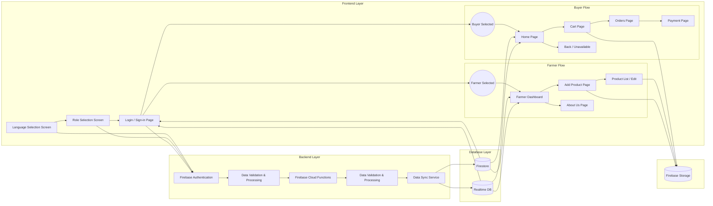

# Khet-Bazaar

## Introduction

Khet-Bazaar is a cross-platform farmer–buyer marketplace built with Flutter and Firebase. It connects farmers and buyers through a simple, real-time, and mobile-first experience. The goal is to simplify agricultural trading and improve access to fresh produce.



## Features

Khet-Bazaar focuses on core marketplace features tailored to agricultural workflows. It leverages Firebase for authentication, data storage, and real-time updates.

- User authentication with Firebase Authentication
- Farmer and buyer role-based dashboards
- Add, edit, and delete product listings
- Image upload and hosting using Firebase Storage
- Real-time product updates using Firestore or Realtime Database
- Order creation, status updates, and basic tracking
- Multi-platform support for Android, iOS, and Web

## Requirements

You need a working Flutter environment and Firebase project to run Khet-Bazaar. Ensure that you can build and run Flutter apps on your target platforms.

- Flutter SDK (stable channel, recent version)
- Dart SDK (bundled with Flutter)
- Android Studio or Visual Studio Code with Flutter extensions
- Xcode and CocoaPods for iOS development on macOS
- A configured Firebase project with Authentication, Firestore or Realtime Database, and Storage
- Emulators or physical devices for Android, iOS, and Web

## Project Structure

The project follows the standard Flutter structure with additional directories for assets and platform-specific code. This structure keeps UI, logic, and resources organized.

- `lib/` – Dart source code, screens, widgets, services, and models
- `assets/` – Images, icons, fonts, and other static resources
- `android/` – Android platform code and Firebase configuration files
- `ios/` – iOS platform code and Firebase configuration files
- `web/` – Web-specific configuration and entry files
- `test/` – Unit and widget tests for the Flutter application

## Installation

You can run Khet-Bazaar locally using the Flutter command-line tools. These steps assume you already configured Flutter on your machine.

1. Clone the repository:
    ```bash
    git clone https://github.com/redskull024/Khet-Bazaar.git
    cd Khet-Bazaar
    ```

2. Fetch dependencies:
    ```bash
    flutter pub get
    ```

3. Run the app on a connected device or emulator:
    ```bash
    flutter run
    ```

Use `flutter devices` to list available emulators and devices before running the app.

## Firebase Setup Guide

Khet-Bazaar integrates tightly with Firebase services for authentication, data, and storage. You must configure Firebase before the app can function correctly.

1. Create a Firebase project:
    - Go to the Firebase console and create a new project.
    - Enable Google Analytics only if you need it.

2. Add apps to the Firebase project:
    - Add an Android app with your application ID.
    - Add an iOS app with your bundle identifier.
    - Add a Web app if you plan to support the browser.

3. Download configuration files:
    - Download `google-services.json` and place it in `android/app/`.
    - Download `GoogleService-Info.plist` and place it in `ios/Runner/`.

4. Configure Firebase for Web:
    - Copy the Web Firebase config from the Firebase console.
    - Add it to the appropriate Flutter web entry or initialization file.

5. Enable required Firebase products:
    - Enable Firebase Authentication and configure sign-in providers.
    - Enable Cloud Firestore or Realtime Database.
    - Enable Firebase Storage and review security rules.

6. Initialize Firebase in Flutter:
    - Call `Firebase.initializeApp()` before using any Firebase services.
    - Use environment-specific options if you target multiple environments.

## Usage

Khet-Bazaar offers different experiences for farmers and buyers. After configuration and installation, users can authenticate and interact with the marketplace.

- Launch the app on Android, iOS, or Web using `flutter run`.
- Sign up or sign in using the configured Firebase Authentication providers.
- Select or assign a role as farmer or buyer during onboarding.
- Farmers can create, edit, and delete listings with images.
- Buyers can browse products, place orders, and track order status.
- All changes sync in real time through Firestore or Realtime Database.

## Configuration

Some parts of Khet-Bazaar can be customized using Dart configuration files and per-environment settings. You can adjust Firebase collections, role mappings, and UI constants.

- Configure app-wide constants in a dedicated `config` or `constants` file under `lib/`.
- Set collection or path names for Firestore or Realtime Database in one place.
- Manage environment-specific settings through build flavors or separate `main` files.
- Update Firebase rules to match your desired access control and security model.

## Build Commands for Release

You can build optimized release artifacts for distribution on each platform. Use the following commands from the project root.

- Build Android APK:
    ```bash
    flutter build apk --release
    ```

- Build Android App Bundle:
    ```bash
    flutter build appbundle --release
    ```

- Build iOS app (requires Xcode and macOS):
    ```bash
    flutter build ios --release
    ```

- Build Web release bundle:
    ```bash
    flutter build web --release
    ```

Follow the official Flutter and platform-specific guides to sign and publish these builds.


## Contributing

Contributions to Khet-Bazaar are welcome and appreciated. Please follow a simple and clear workflow when contributing.

- Fork the repository to your GitHub account.
- Create a feature branch from the main branch for your changes.
- Run `flutter pub get` and ensure the app builds and runs cleanly.
- Add or update tests under `test/` when relevant.
- Open a pull request with a clear description of your changes.

## License

This project is licensed under the MIT License. You are free to use, modify, and distribute this software under the terms below.

```text
MIT License

Copyright (c) 2024 redskull024

Permission is hereby granted, free of charge, to any person obtaining a copy
of this software and associated documentation files (the "Software"), to deal
in the Software without restriction, including without limitation the rights
to use, copy, modify, merge, publish, distribute, sublicense, and/or sell
copies of the Software, and to permit persons to whom the Software is
furnished to do so, subject to the following conditions:

The above copyright notice and this permission notice shall be included
in all copies or substantial portions of the Software.

THE SOFTWARE IS PROVIDED "AS IS", WITHOUT WARRANTY OF ANY KIND, EXPRESS
OR IMPLIED, INCLUDING BUT NOT LIMITED TO THE WARRANTIES OF MERCHANTABILITY,
FITNESS FOR A PARTICULAR PURPOSE AND NONINFRINGEMENT. IN NO EVENT SHALL
THE AUTHORS OR COPYRIGHT HOLDERS BE LIABLE FOR ANY CLAIM, DAMAGES OR
OTHER LIABILITY, WHETHER IN AN ACTION OF CONTRACT, TORT OR OTHERWISE,
ARISING FROM, OUT OF OR IN CONNECTION WITH THE SOFTWARE OR THE USE OR
OTHER DEALINGS IN THE SOFTWARE.
```
